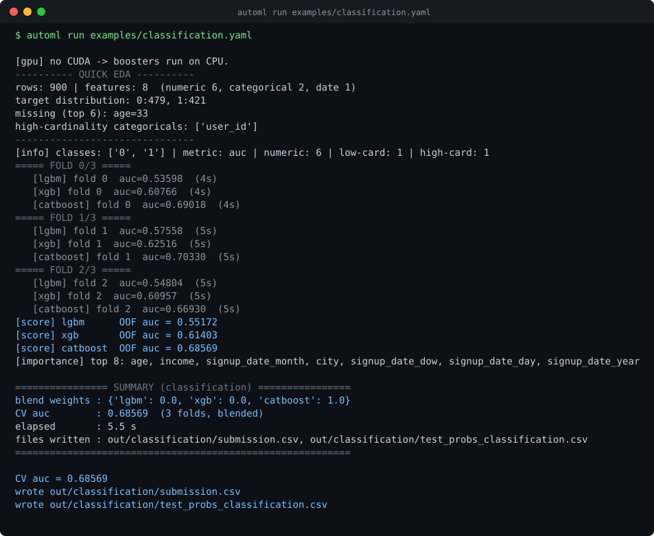

# automl-competition-kit

A competition-focused ML pipeline package: four task types — tabular classification, tabular regression, time series and image classification — behind a single config file. You point it at your data, run one command, and it writes a submission file and a cross-validated score.

It is built for the shape of a contest, not the shape of a product: the input is a config, the output is a file you can upload.



---

## Why it's interesting: leakage-safe by construction

This is the part worth reading, and the reason the repo exists.

Most quick pipelines leak. Not obviously — they leak in the three places where the fast way and the correct way look identical in the code:

**1. Target encoding is fitted inside the fold, never on the whole training set.**
The standard shortcut computes a category → mean-target map on all of `train`, then cross-validates on top of it. Every validation row has already contributed to its own encoded feature, so CV scores come out high and the leaderboard comes out low. Here the encoder is fitted on the fold-train rows only and applied to the fold-validation and test rows separately, once per fold ([`core/prep.py`](automl/core/prep.py) `fold_safe_target_encode`, called from inside each fold loop). Unseen categories fall back to the fold-train mean, not the global mean.

**2. Time series is split by time, never at random.**
`KFold(shuffle=True)` on dated rows trains on the future to predict the past. The forecast engine never shuffles: validation is the last *H* dates as one block, with `expanding` available for several such blocks ([`tasks/forecast.py`](automl/tasks/forecast.py)).

**3. Lags and rolling statistics are shifted inside each series.**
A rolling mean computed with the current row inside its own window is a leak that looks like a feature. Every rolling statistic here is built on `shift(1)` within a `groupby`, so the window for row *t* ends at *t-1*, and it never crosses from one series into another ([`_lag_roll`](automl/tasks/forecast.py)). Multi-step forecasts run recursively, feeding the model's own predictions forward — never the true future values.

Two smaller ones, for the same reason: blend weights are searched on out-of-fold predictions only, and the binary decision threshold for accuracy/F1 is picked on out-of-fold predictions rather than on the fold each model was validated against.

You can check all of this rather than take my word for it. `python benchmark/leakage_demo.py` takes half a minute, needs no downloads, and prints the difference between the two approaches on a dataset with a known answer:

```
         cv auc     holdout    gap
honest   0.6234     0.6202     +0.0033
leaky    0.8996     0.5344     +0.3651
```

The leaky row is target encoding fitted before the split — the ordinary shortcut. It reports a cross-validated AUC of 0.90 and delivers 0.53 on data it has not seen. The honest row reports 0.62 and delivers 0.62.

The example datasets have a known signal planted in them too. On the regression example the held-out R² is ≈0.72 against truth the pipeline never saw; on the forecast example the model's test RMSE is ≈6.0 against ≈13.7 for a last-value naive baseline. Both scripts that build the data are in `examples/`.

---

## Quickstart

```bash
pip install -r requirements.txt
pip install -e .                              # puts the `automl` command on PATH
automl run examples/classification.yaml
```

No install? `python -m automl run examples/classification.yaml` works from the repo root.

Expected output, from the run pictured above:

```
[info] classes: ['0', '1'] | metric: auc | numeric: 6 | low-card: 1 | high-card: 1
===== FOLD 0/3 =====
   [lgbm] fold 0  auc=0.53598  (4s)
   [xgb] fold 0  auc=0.60766  (4s)
   [catboost] fold 0  auc=0.69018  (4s)
...
[score] lgbm      OOF auc = 0.55172
[score] xgb       OOF auc = 0.61403
[score] catboost  OOF auc = 0.68569

================ SUMMARY (classification) ================
blend weights : {'lgbm': 0.0, 'xgb': 0.0, 'catboost': 1.0}
CV auc        : 0.68569  (3 folds, blended)
elapsed       : 5.5 s
files written : out/classification/submission.csv, out/classification/test_probs_classification.csv
==========================================================
```

Two files land in `out/classification/`: `submission.csv`, and `test_probs_classification.csv` — the per-class probabilities with a fixed column order, so several runs can be ensembled afterwards.

The same thing from Python, for a notebook:

```python
from automl import run

result = run("examples/classification.yaml")     # or run({...}) with the same structure
print(result["cv_score"], result["submission_files"])
```

The CLI calls that function. There is one code path, not two.

---

## Config

One file. Common fields at the top, task-specific fields below them.

```yaml
task: classification        # classification | regression | forecast | image | auto

data:
  train: data/train.csv     # CSV or parquet path (paths are relative to this file)
  test: data/test.csv
  target: label             # the column to predict
  id: id                    # submission key; falls back to the row index
  drop: [notes, raw_blob]   # columns to ignore

  # forecast only
  date: date                # the time column — required for forecast
  group: [store, item]      # omit for a single series

  # image only
  image_col: filename       # CSV mode: the file-name column
  label_col: label
  image_root: data/images   # where those file names live

run:
  preset: fast              # fast | full  — see below
  metric: auc               # per task, see "What each engine does"
  folds: 5
  seed: 42
  time_budget_sec: 600      # wall-clock cap; a partial run still writes a valid submission
  out_dir: out/run1
  download: false           # true auto-downloads the submission inside Colab
  submission_example: data/sample_submission.csv   # the shape to copy

  # classification / image
  positive_class: "1"
  result_as_proba: true

  # regression
  log_target: auto          # auto | true | false
  non_negative: auto

  # forecast
  horizon: 14
  strategy: auto            # auto | recursive | direct
  cv_scheme: holdout        # holdout | expanding
  season_period: 7

model:
  n_estimators: 10000
  learning_rate: 0.01
  early_stopping: 300
  # image
  backbone: auto            # any timm model name, or `auto`
  img_size: 300
  epochs: 8
```

An unknown key is an error, not a shrug:

```
$ automl validate config.yaml
config error: unknown key 'targat' under 'data' for task 'classification'.
  Did you mean 'target'?
```

A missing required field names the field and shows an example value. A key put under the wrong section says where it belongs. `automl validate` checks all of this without training anything.

### Output shape

The submission takes the shape of `submission_example`, whatever that is: a JSON example produces a JSON list with the example's own key names, a CSV example produces a CSV with the example's columns in the example's order. With no example you get a plain CSV — an id column plus `target`. No format shows up unless something asked for it.

---

## Task selection

| Your problem | Engine |
|---|---|
| Rows, a categorical target | `classification` |
| Rows, a numeric target, no time axis | `regression` |
| A date column, and the test rows are in the future | `forecast` |
| A folder of images, or a CSV of file names and labels | `image` |

`task: auto` decides by looking at the data, prints its reasoning, and gets overridden by writing the task out:

```
[auto] task=regression — the target is numeric and continuous, and no date column is set.
```

It checks, in order: is `data.train` a directory of images (or is `image_root`/`image_col` set) → `image`; is `data.date` set → `forecast`; is the target non-numeric, or whole-numbered with at most 20 distinct values → `classification`; otherwise → `regression`. It is a heuristic and it gets edge cases wrong — a numeric-coded 30-class label, or a dated table where the test rows are not in the future. Write the task explicitly when it matters.

---

## Presets

| | `fast` (default) | `full` |
|---|---|---|
| Tabular | 400 trees, lr 0.05, 3 folds, 120 s cap | 10 000 trees, lr 0.01, 5 folds, 5 000 s cap |
| Forecast | 400 trees, short lag set, holdout CV | 6 000 trees, full lag set |
| Image | b0 backbone, 224 px, 3 epochs, 2 folds | auto backbone, 300 px, 8 epochs, 5 folds |
| Example runtime | 3–6 s per tabular example on a laptop CPU | minutes to hours |

`fast` is the default everywhere, including the examples, so a clone-and-run finishes while you are still looking at it. Switch with `preset: full` in the config or `--preset full` on the command line. Anything you set yourself wins over the preset.

Every engine also respects `time_budget_sec`: when the budget runs out mid-run it stops after the current fold and writes a valid submission from the folds that finished, rather than dying with nothing on disk.

---

## What each engine does

**`classification`** — LightGBM + XGBoost + CatBoost, stratified K-fold, weights blended on out-of-fold predictions. Low-cardinality categoricals are ordinal-encoded, high-cardinality ones target-encoded inside the fold, and CatBoost sees them raw. Metrics: `logloss`, `accuracy`, `f1`, `auc`. Binary and multiclass are detected from the data; class imbalance turns on weighting automatically.

**`regression`** — the same three models and the same preprocessing, with binned-stratified folds. A skewed target (or `metric: rmsle`) is fitted on `log1p` and reversed with `expm1` before anything is scored, so every number you see is in the original units. Metrics: `rmse`, `mae`, `rmsle`, `r2`.

**`forecast`** — one global LightGBM over all series, with calendar features, lags and shifted rolling statistics, against a seasonal-naive baseline; whichever wins on the time-based validation block is what produces the final forecast. Recursive for multi-step horizons, direct for one. Single or multiple series. Prophet is used only if it is installed and `use_prophet: true`. Metrics: `rmse`, `mae`, `rmsle`, `smape`.

**`image`** — a timm backbone fine-tuned with discriminative learning rates (frozen backbone for the first epochs), stratified K-fold, mixed precision, horizontal-flip TTA, per-fold test-time averaging. Reads a folder tree or a CSV. Unreadable images are skipped; a valid submission is written as soon as fold 0 finishes. Metrics: `logloss`, `accuracy`.

Scores follow a higher-is-better convention internally, so the blend search can maximise without knowing the metric. Classification therefore reports log loss negated (`-0.42` means a log loss of 0.42); regression and forecast report the plain positive error value.

---

## Limitations

Things this does not do, and places where it is weak:

- **It targets submissions, not production.** No serving, no model registry, no drift monitoring, no reproducible artifact store. It fits models and writes a file.
- **No hyperparameter search.** Fixed, reasonable defaults. The name says AutoML; this part of AutoML is deliberately absent. Optuna in front of it would probably help and is not here.
- **The image engine wants a GPU.** It runs on CPU and the examples finish, but on a real dataset it is not practical.
- **Four task types only.** No NLP, no multi-label classification, no segmentation, no object detection, no recommendation, no ranking.
- **`task: auto` is a heuristic** and gets edge cases wrong. It prints what it decided so you can catch it; override it by writing `task` explicitly.
- **High-cardinality target encoding falls back to ordinal encoding for multiclass problems.** The binary path is the good one; multiclass gets a cruder feature, and that is a real gap rather than a design choice.
- **Never measured against another AutoML tool.** No comparison against AutoGluon, FLAML or anything else has been run, so there is no claim here about accuracy or speed relative to any of them. `benchmark/` compares this pipeline against a plain single-LightGBM baseline on public datasets; that is the only comparison that exists.
- **The blend is a random Dirichlet search**, not stacking. It is cheap and it usually helps; it is not the strongest thing available.
- **Column-name heuristics are English-leaning** (with a few Turkish date keywords). Set columns explicitly if yours are named unusually.
- **No test suite.** The examples are the check: four configs that run end to end on synthetic data with a known signal.

## Benchmark

`benchmark/` holds the measurement code: public datasets, a 20% held-out split,
and the same split given to this pipeline (both presets) and to a single
LightGBM with default parameters. Every system's own cross-validated estimate is
recorded next to its held-out score, so an optimistic pipeline is visible rather
than flattered. See [benchmark/README.md](benchmark/README.md) for how to run it,
and `benchmark/colab_benchmark.ipynb` for the GPU parts.

## Prior art

More mature and more general alternatives exist, and this repo does not replace any of them: [AutoGluon](https://github.com/autogluon/autogluon), [H2O AutoML](https://github.com/h2oai/h2o-3), [FLAML](https://github.com/microsoft/FLAML), [PyCaret](https://github.com/pycaret/pycaret), [auto-sklearn](https://github.com/automl/auto-sklearn), [MLJAR-supervised](https://github.com/mljar/mljar-supervised), [LightAutoML](https://github.com/sb-ai-lab/LightAutoML). All of them do more than this does.

What is different here is narrow and specific: the format is a contest submission from end to end, four task types sit behind one config with automatic routing between them, and the leakage handling is a deliberate design property rather than something to be careful about afterwards.

## Where this came from

This is the code that placed 2nd at AI Fest 2026 — four separate scripts then, packaged here.

## License

MIT — see [LICENSE](LICENSE).
